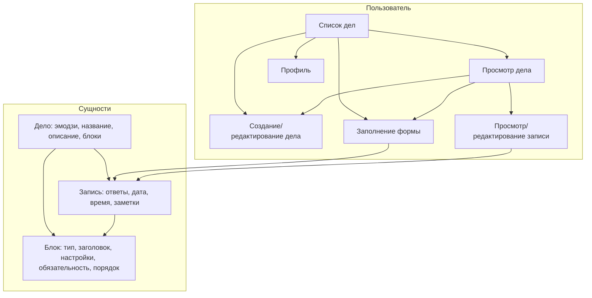

# Бизнес-логика Log Life (по требованиям)

Краткое описание бизнес-логики приложения по документам из [docs/requirements/](requirements/).

---

## 1. Назначение продукта

**Log Life** — приложение для **личных форм и истории записей**. Пользователь сам создаёт «дело» (форму с вопросами), многократно заполняет её и просматривает историю по каждому делу. В отличие от Google Forms, формы предназначены для **самого пользователя**, а не для сбора ответов от других.

**Целевые сценарии:** учёт тренировок, привычек, самочувствия, событий — одна форма на «дело», много записей во времени.

---

## 2. Доменная модель

### 2.1 Дело (Deed)

- **Сущность:** карточка/форма, которую пользователь создаёт и многократно заполняет.
- **Состав:**
  - Эмодзи или символ (визуальный идентификатор).
  - Название (обязательно).
  - Описание (необязательно, многострочный текст).
  - Набор **блоков вопрос–ответ** (порядок задаётся пользователем).
- **По умолчанию при создании:** один блок типа «Число».
- **Связь:** у одного пользователя много дел; к одному делу привязано много записей.

### 2.2 Блок (Block)

- **Сущность:** один вопрос в рамках дела с фиксированным типом ввода.
- **Типы блоков:**
  - Число — одно число.
  - Текст (строка) — одна строка.
  - Текст (абзац) — многострочный текст.
  - Один из списка — один выбранный вариант (варианты настраиваются, порядок задаётся).
  - Несколько из списка — несколько вариантов (варианты и порядок настраиваются).
  - Шкала — значение на шкале (макс. 10 делений, подписи первого и последнего значения).
  - Да/Нет — отметка да/нет.
- **Свойства:** «Обязательное значение» (да/нет), порядок среди других блоков (и порядок вариантов в списках).
- **Удаление:** блок можно удалить при создании/редактировании дела; в старых записях данные по удалённому блоку сохраняются для истории (название, значение, дата удаления).

### 2.3 Запись (Record)

- **Сущность:** один момент заполнения формы по конкретному делу — одна «отправка» формы.
- **Состав:**
  - Ответы по всем блокам дела (в формате, соответствующем типу блока).
  - **Служебные поля:** дата добавления, время добавления, блок «Заметки» (свободный текст).
- **Связь:** запись принадлежит ровно одному делу; по делу можно получить список всех записей (история).
- Дата и время по умолчанию — текущие при создании; дату, время и заметки можно менять при создании записи и при последующем редактировании записи.

---

## 3. Бизнес-правила

### 3.1 Упорядочивание ([05])

- Блоки в деле можно менять местами (drag-and-drop или кнопки вверх/вниз). Порядок определяет отображение в форме, при редактировании дела и при просмотре записи.
- В блоках «Один из списка» и «Несколько из списка» варианты ответов тоже можно упорядочивать; этот порядок используется при настройке и при выборе ответа.

### 3.2 Обязательность ([06])

- У каждого блока есть настройка «Обязательное значение».
- При сохранении записи все блоки с включённой обязательностью должны быть заполнены.
- Если хотя бы один обязательный блок пуст — запись не сохраняется, пользователю показывается сообщение об ошибке.

### 3.3 Поведение при редактировании дела ([13])

- **Название/описание дела:** хранятся в деле; везде в UI показывается текущее название/описание (в т.ч. при просмотре старых записей).
- **Удаление блока:** блок исчезает из формы; в старых записях данные по нему сохраняются (название на момент удаления, значение, дата удаления); при просмотре старой записи удалённые блоки показываются (например, с пометкой или в секции «Удалённые поля»).
- **Добавление блока:** в старых записях для нового блока значения нет — отображается пусто/«Не заполнено».
- **Переименование блока:** везде показывается текущий заголовок блока (записи не хранят снимок старого текста вопроса).
- **Смена типа блока:** в старых записях сохранённое значение считается устаревшим; при просмотре показывается с пометкой и предлагается «Обновить» (актуализировать под новый тип или оставить как есть).
- **Изменение списка вариантов:** переименование варианта — везде новое название; добавление варианта — только для новых записей; удаление варианта — в старых записях, где он был выбран, показывается с пометкой «устарело» и возможность обновить.
- **Изменение параметров блока без смены типа** (например, шкала 10 → 5 делений): в старых записях значение остаётся; при просмотре — пометка об устаревании и возможность обновить.

---

## 4. Экраны и сценарии

**Навигация:** на мобильных устройствах список дел и профиль доступны через нижнюю панель вкладок (Дела / Профиль); см. [15-layout-navigation](requirements/15-layout-navigation.md).

### 4.1 Список дел ([07])

- Главный экран: карточки дел (эмодзи, название, при необходимости описание/превью).
- Действия: **переход в дело** (страница просмотра дела), **добавить запись** (экран заполнения формы по этому делу).
- Кнопка «+ Создать дело» → создание дела. Ссылка «Профиль» → страница профиля.

### 4.2 Создание и редактирование дела ([08])

- Поля: эмодзи, название, описание. Список блоков с типом, настройками типа, «Обязательное значение», порядок, удаление блока.
- «+ Добавить блок» — выбор типа (по умолчанию при создании — один блок «Число»).
- Режимы: создание (пустые поля + один блок «Число»), редактирование (загруженные данные и порядок блоков).
- Сохранение → возврат к списку дел или к странице дела.

### 4.3 Заполнение формы ([09])

- Заголовок дела (эмодзи, название, описание). Редактируемые дата и время записи (по умолчанию — текущие).
- Блоки в порядке из дела; каждый рендерится по типу (число, строка, абзац, один/несколько из списка, шкала, да/нет). Обязательные помечаются.
- Внизу — блок «Заметки» (свободный текст).
- Кнопка «Добавить запись»: проверка обязательных полей; при успехе — создание записи и редирект (например, на дело или список дел).

### 4.4 Просмотр дела ([14])

- Эмодзи, название, описание. Блок **история записей** по этому делу (дата, время, превью ответов).
- Действия: **добавить запись**, **редактировать дело**, **удалить дело** (с подтверждением).

### 4.5 История записей ([10])

- Реализована на странице просмотра дела: список записей по делу (дата, время, превью).
- Открытие записи → просмотр полных ответов и служебных полей; при необходимости — редактирование даты, времени, заметок (и при необходимости ответов, с учётом правил устаревания из [13]).

### 4.6 Профиль ([12])

- Раздел профиля: авторизация (заглушка «Скоро»), экспорт в CSV (заглушка «Скоро»). Навигация в/из списка дел и общее меню.

---

## 5. Сводка потоков данных

- **Дело** задаёт форму (блоки и их порядок); **запись** — один снимок ответов по этой форме плюс дата, время и заметки.
- Редактирование дела не удаляет данные в старых записях: удалённые блоки хранятся как история; новые блоки в старых записях пустые; смена типа/параметров помечается как устаревшее с возможностью обновить.

---

Документ составлен по: [00-overview](requirements/00-overview.md) – [14-screen-deed-view](requirements/14-screen-deed-view.md).
